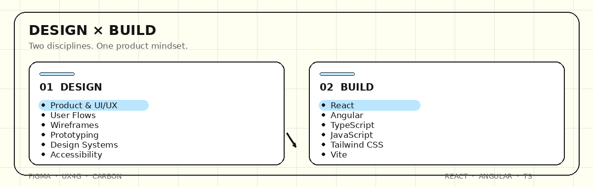

 

### DESIGNING EXPERIENCES · BUILDING PRODUCTS

I create thoughtful digital experiences where **design, systems and technology** meet.

 

---

 

---

## ✦ HOW I WORK

From a problem to a product — one intentional step at a time.

 

 

---

## ✦ SELECTED WORK

### 🏛️ CENSUS ENUMERATOR DASHBOARD

**Enterprise UX · Dashboard Design · UX4G · Design Systems**

A structured experience for field enumerators to manage blocks, houses and census applications with clarity and efficiency.

 

### ⚡ EV CHARGING PLATFORM

**Dashboard UX · Data Visualization · Product Design**

A monitoring experience designed to make charging infrastructure, usage and operational data easier to understand.

 

### ♿ TRANSABLE

**Accessibility · Mobile UX · Inclusive Design**

An accessibility-focused product exploring communication through sign translation, voice, text, Braille and haptic interactions.

 

### 💊 MEDITRACK

**Healthcare UX · Mobile Product · Interaction Design**

A simple medication management experience focused on reminders, tracking and reducing everyday friction.

 

---

## ✦ MY TOOLKIT

### DESIGN

`Figma` · `Adobe XD` · `Photoshop` · `Illustrator`

### PRODUCT & SYSTEMS

`UX4G` · `Carbon Design System` · `Design Systems` · `Accessibility` · `8pt Grid`

### DEVELOPMENT

`React` · `Angular` · `TypeScript` · `JavaScript` · `Tailwind CSS` · `Vite`

### WORKFLOW

`Git` · `GitHub` · `Figma Prototyping` · `Wireframing` · `User Flows`

 

---

## ✦ A LITTLE ABOUT ME

I'm **Saanvi Smakshi Sahoo**, a UI/UX Designer and Frontend Developer.

I enjoy turning complex requirements into interfaces that feel **clear, purposeful and easy to use**.

My work sits between:

**People × Products × Technology**

 

---

## ✦ CURRENTLY EXPLORING

`Product Design` · `Design Systems` · `Frontend Development` · `Accessibility` · `Creative Interactions`

 

---

### LET'S BUILD SOMETHING MEANINGFUL.

 

[🌐 PORTFOLIO](https://smavii.saanvismakshisahoo.workers.dev/)
&nbsp;&nbsp;·&nbsp;&nbsp;
[💼 LINKEDIN](https://www.linkedin.com/in/saanvisahoo/)

  

Designed with intention · Built with curiosity · Powered by SMAVII

